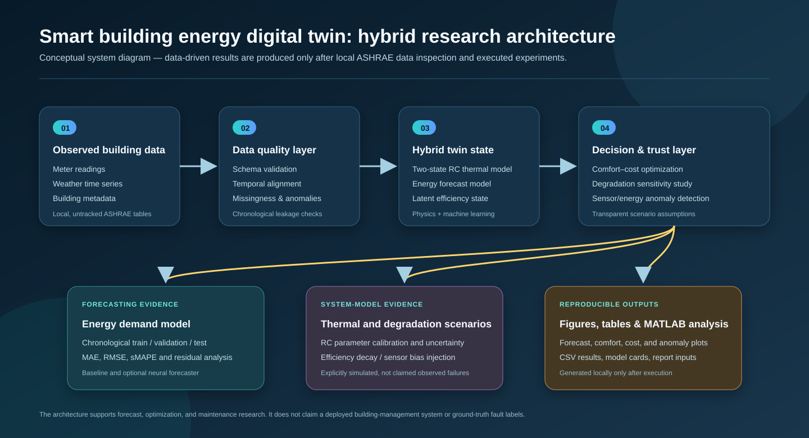
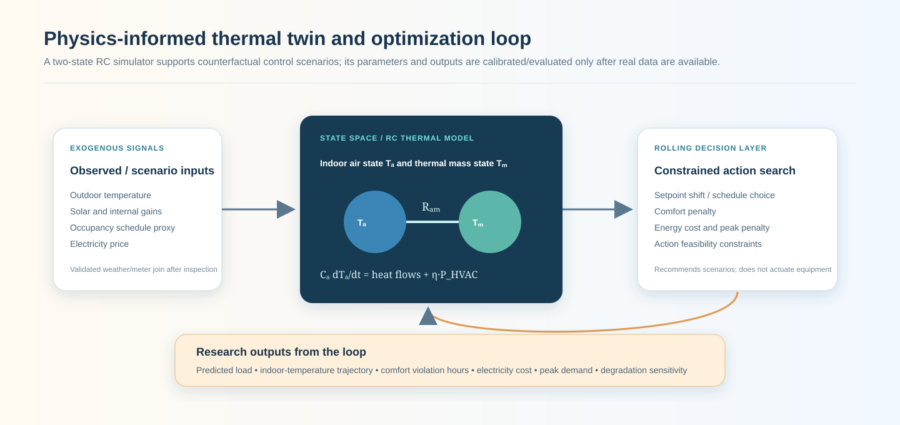
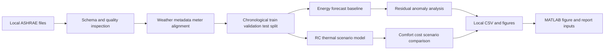
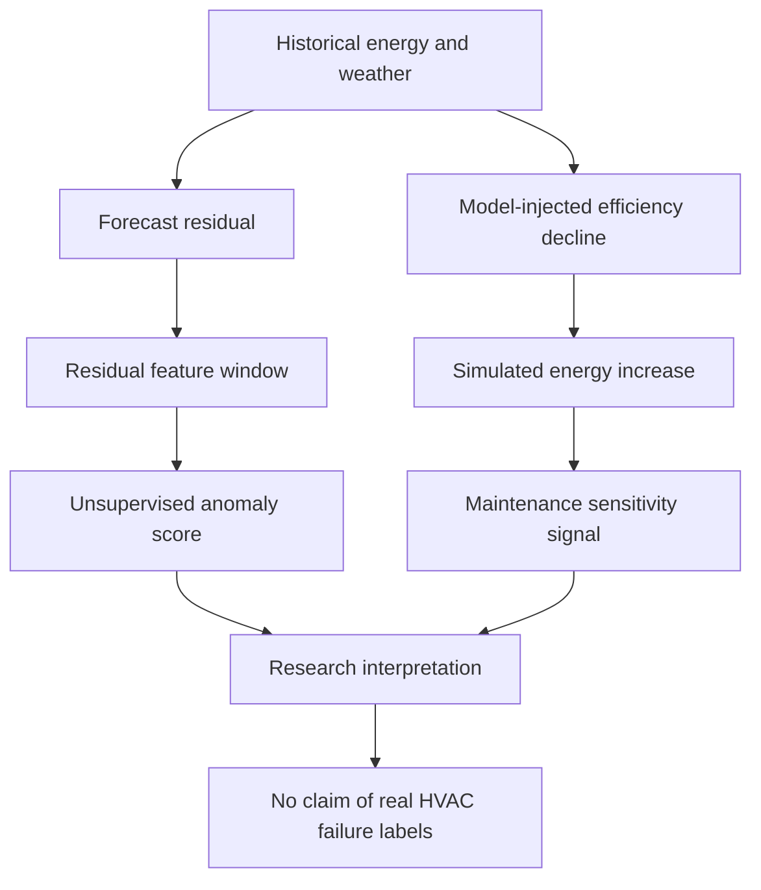

# Smart Building Energy Digital Twin

<p align="center"><strong>Research infrastructure for energy forecasting, thermal simulation, transparent degradation scenarios, and comfort-aware decision analysis.</strong></p>

<p align="center">
  <a href="../../actions/workflows/python-checks.yml"></a>
  <a href="LICENSE"></a>
  
</p>

> **Research boundary:** this independent academic prototype keeps raw building data, processed data, trained models, and experiment outputs local. No forecast score, calibrated parameter, or equipment-failure claim is included until executable code generates it from downloaded data.

## Research objective

Can a hybrid digital twin combine historical energy data, weather, building metadata, a physics-informed thermal model, and transparent scenario analysis to support energy-aware decisions while preserving indoor-comfort constraints?

| Research question | Evidence produced only after execution |
| --- | --- |
| How accurately can energy use be forecast? | Chronological test MAE, RMSE, sMAPE, residual figure |
| Can a two-state RC model support interpretable what-if analysis? | Temperature trajectories and parameter record |
| What comfort-cost trade-offs exist across temperature targets? | Scenario table and trade-off figure |
| How sensitive are signals to efficiency decline or sensor bias? | Explicitly simulated degradation-study outputs |

## Architecture

<p align="center"></p>

The image is a conceptual workflow, not a performance chart or deployed system claim.

| Layer | Role | Evidence |
| --- | --- | --- |
| Data foundation | Validate and align meter readings, weather, and metadata | Inspection JSON, missingness, time range |
| Forecast layer | Predict future energy demand with causal inputs | Test metrics and forecast plot |
| Physics layer | Simulate indoor air and thermal mass | RC scenario trajectories |
| Degradation layer | Inject efficiency decline and sensor bias transparently | Simulated scenario records |
| Decision layer | Compare candidate temperature targets | Cost proxy, energy proxy, comfort degree-hours |
| Reproducibility | Record configuration and data boundary | YAML, tests, CI, local results |

## Download this dataset

Download **ASHRAE Great Energy Predictor III** competition data from Kaggle. Extract only:

```text
data/raw/ashrae/
├── train.csv
├── weather_train.csv
└── building_metadata.csv
```

Do **not** upload these files to GitHub. `.gitignore` excludes them. See [`data/README.md`](data/README.md) for the local-data policy and a clear degradation-study boundary.

## Physics-informed thermal loop

<p align="center"></p>

The single-zone RC model uses indoor-air state \(T_a\) and thermal-mass state \(T_m\):

\[
C_a\frac{dT_a}{dt}=\frac{T_o-T_a}{R_{ao}}+\frac{T_m-T_a}{R_{am}}+\eta P_{HVAC}+Q_{internal}+Q_{solar}
\]

\[
C_m\frac{dT_m}{dt}=\frac{T_a-T_m}{R_{am}}
\]

It supports research scenarios, not real equipment actuation. Python and MATLAB implement the same thermal update.

## Research safeguards



- Chronological partitions prevent future-data leakage.
- Building IDs must be explicitly selected in configuration; the code refuses arbitrary sampling.
- Forecasting starts with causal calendar, weather, and available static metadata features.
- The degradation study is labeled simulated because meter data do not provide component-level fault labels.
- The scenario engine recommends what-if outcomes only; it does not control equipment.

## Installation

```bash
git clone https://github.com/Hirakhyzer/smart-building-energy-digital-twin.git
cd smart-building-energy-digital-twin
python -m venv .venv
```

Windows:

```bat
.venv\Scripts\activate
```

macOS/Linux:

```bash
source .venv/bin/activate
```

```bash
python -m pip install --upgrade pip
python -m pip install -r requirements.txt
```

## Run the research workflow

### 1. Inspect the downloaded data

```bash
python scripts/inspect_data.py
```

This creates `outputs/results/data_summary.json` with schema, type, missingness, duplicates, meter counts, building/site counts, and time coverage.

### 2. Choose a small explicit building subset

After reading the summary, edit `configs/base.yaml`:

```yaml
data:
  meter_type: 0              # confirm from inspection
  building_ids: [0, 1, 2]    # replace with real inspected IDs
```

### 3. Run chronological energy forecasting

```bash
python scripts/run_forecast.py --config configs/base.yaml
```

Generated locally:

```text
outputs/results/forecast_metrics.json
outputs/results/forecast_predictions.csv
outputs/figures/forecast_window.png
```

### 4. Run thermal comfort-cost scenarios

```bash
python scripts/run_scenarios.py --config configs/base.yaml --horizon 168
```

```text
outputs/results/thermal_scenarios.csv
outputs/results/thermal_scenario_summary.json
outputs/figures/comfort_cost_tradeoff.png
```

### 5. Run a simulated degradation study

```bash
python scripts/run_degradation_scenario.py --config configs/base.yaml
```

This generates a labelled synthetic efficiency-decline study; it is not measured HVAC deterioration.

## Forecasting protocol

| Feature group | Examples | Rationale |
| --- | --- | --- |
| Calendar | hour, day of week, month, weekend | Captures recurring operational schedules |
| Weather | temperature, dew point, cloud, pressure, wind | Captures environmental energy drivers |
| Static metadata | floor area, year built, floor count, site, meter | Captures available building heterogeneity |

The first model is `HistGradientBoostingRegressor`. Metrics are MAE, RMSE, and sMAPE. Target lags are intentionally deferred until data cadence and missing-data behavior are inspected.

## Degradation and anomaly boundary



## MATLAB workflow

```matlab
addpath('matlab')
plot_forecast_results('outputs')
```

| File | Purpose |
| --- | --- |
| `matlab/rc_thermal_step.m` | Two-state RC thermal update |
| `matlab/plot_forecast_results.m` | Reads locally generated Python forecast outputs |

## Repository map

```text
assets/                  Original conceptual SVG figures
actions/                 GitHub Actions workflow
configs/                 Reproducible YAML settings
data/                    Download instructions; raw data ignored
docs/                    Methodology and report template
matlab/                  Thermal-model and figure scripts
outputs/                 Local-only results, figures, and models
scripts/                 Inspection and experiment commands
src/buildingtwin/        Data, forecasting, RC model, scenarios, degradation, anomalies
tests/                   Data-free unit tests
```

## Documentation

- [`docs/methodology.md`](docs/methodology.md): detailed data, forecasting, RC-model, and limitation protocol.
- [`docs/report_template.md`](docs/report_template.md): report skeleton for locally generated evidence only.
- [`assets/README.md`](assets/README.md): why conceptual SVGs are not result figures.
- [`data/README.md`](data/README.md): local download and data-handling guide.

## Limitations

1. Data quality and weather alignment determine the credibility of any forecast result.
2. The RC model is a simplified single-zone approximation and needs per-subset calibration.
3. Price and occupancy are scenarios unless validated external sources are integrated.
4. Degradation studies are simulated unless ground-truth equipment labels are added later.
5. The project supports research decision analysis, not automatic equipment control.

## License

MIT License. Downloaded datasets may have separate terms and are not included in this repository.
